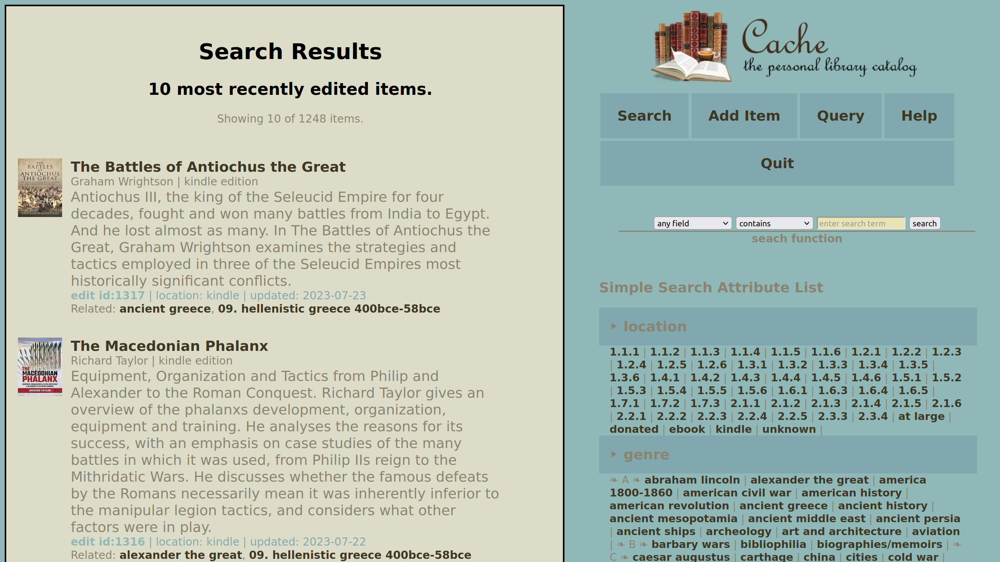

# Cache

Cache is a personal collections management system for books. While Cache is browser based, it runs entirely on your computer and keeps all your data locally in YAML--a text based format.

Cache is written in the Ruby programming language which must be installed and configured on your computer for Cache to run. Details on installing Ruby can be found at Ruby-lang.org. Cache uses the Webrick web server which up until Ruby version 3.0 was part of the Ruby core distribution. With Ruby 3.0, the Webrick Gem must be specifically installed. Cache also depends upon the YAML gem, though at the time of this writing that is still part of the Ruby Core Distribution. Cache is platform agnostic. As long as you have Ruby and Webrick running on your system, Cache should run just fine.

Cache is designed as a single-user application. While it does incorporate a web server, it does not perform a lot of input data validation. For this reason it should be protected behind your computer's firewall.

The various fields in Cache are intentionally generic providing flexibility in cataloging many different types books. It incorporates a tagging system to create relationships between items that don't quite fit into the pre-defined field schema. Cache allows you to upload electronic versions of books and documents and catalog them along with the rest of your collection. No more trying to find which folder you stored your e-books in!

Simple single-field searches are easily accessible from the main menu and a more flexible (though slightly more complex) querying system is also available. The Query system allows you to define reports and run them repeatedly.

### Cache Data fields:

- **name (required):** This is the title of the book.

- **author(s):** The author or authors (separated by commas) of the book.

- **description:** A detailed description of the item.

- **id:** This is a system assigned numeric identifier, it is not editable by the user.

- **genre:** (highly suggested) A single broad grouping of similar topics.

- **tags:** A list of related subject areas or concepts. Multiple values can be entered by separating the tags with commas.

- **location:** Where is the item stored? Room? Bookcase? Shelf?

- **publishing information / isbn:** (highly suggested) The International Standard Book Number of the book.

- **publishing information / format:** Hardback, paperback, e-book, etc.

- **publishing information / pages:** Number of pages in the book.

- **publishing information / edition:** Which edition of the book?

- **publishing information / language:** What language is the book written in?

- **publishing information / publisher:** Who published the book?

- **publishing information / published:** What year or date was the book published?

- **images / icon:** A small image to represent this item--should be 70 pixels wide and 100 pixels high for display on the item and search pages. Could be shared with related class of items. Icon images cannot be deleted in Cache because they may be used by multiple items. They can be manually deleted from the cache/application_images folder.

- **images / item image:** A larger image of the specific item. Multiple images can be uploaded but not all at the same time. Upload one image, save the item, edit it again to upload the second image, etc. individual images can be deleted in this section by clicking the 'delete' box beneath the image and then saving the item.

- **valuation / cost:** What did you pay to purchase the item?

- **valuation / value:** How much would you want to sell this item?

- **valuation / acquired date:** Date on which you acquired this item.

- **valuation / disposition date:** Date on which you disposed of this item.

- **links / web review/source:** Supply an internet url for the item (for example to the seller's web site) or, if cataloging an electronic document you can load it into Cache here.

- **links / notes:** Random notes about the item.

- **delete:** To delete the item from Cache, click the 'enable' check box and then click on the 'delete' button. This will delete the record of the item but uploaded pictures, icons or electronic documents will remain in the Cache folders.

